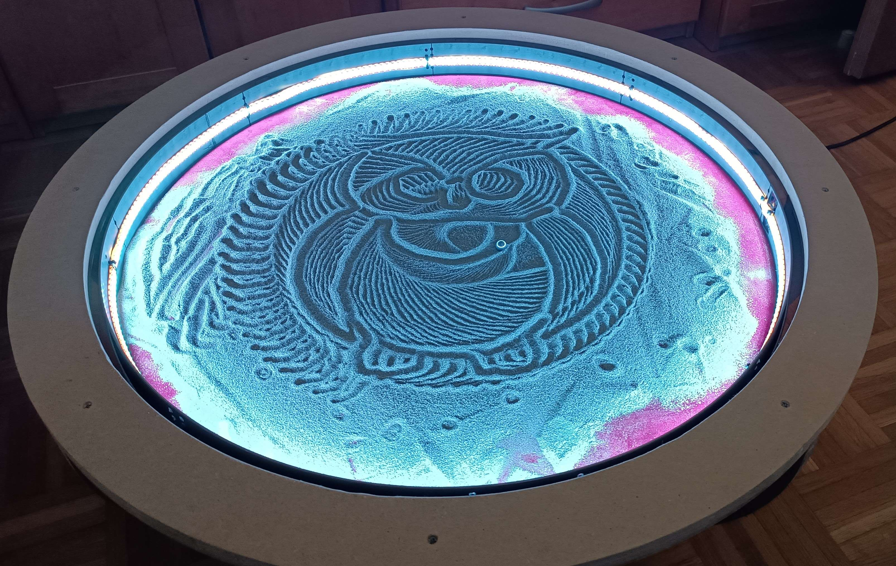

# Sand-table
Python and Arduino code to control a homemade sand table with a polar CS based kinematics design.

The whole thing is curently still in developlemnt.

What is implemented so far:
- Stepper control on Arduino
- Serial communication via Serial between Arduino and PC
- Svg to path converter -> works for basic paths made in Inkscape

TODO:
- better path/img input to sand table
- web control via Raspberry PI
- LED strip control

