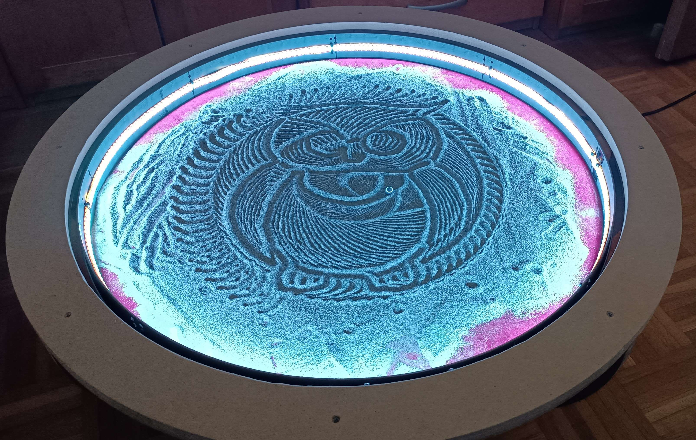
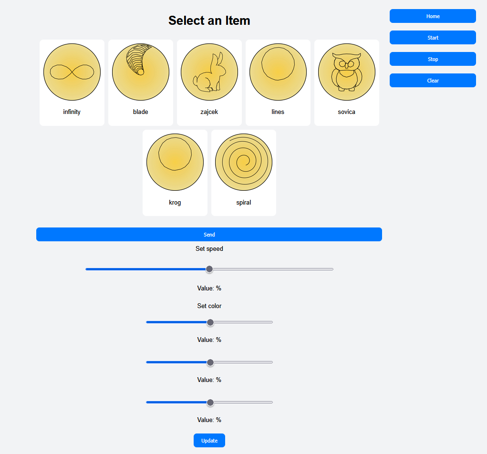

# Sand-table
Python and Arduino code to control a homemade sand table with a polar CS based kinematics design.

The whole thing is curently still in developlemnt.

The device currently supports basic web access for giving predefined parametric drawing paths.

